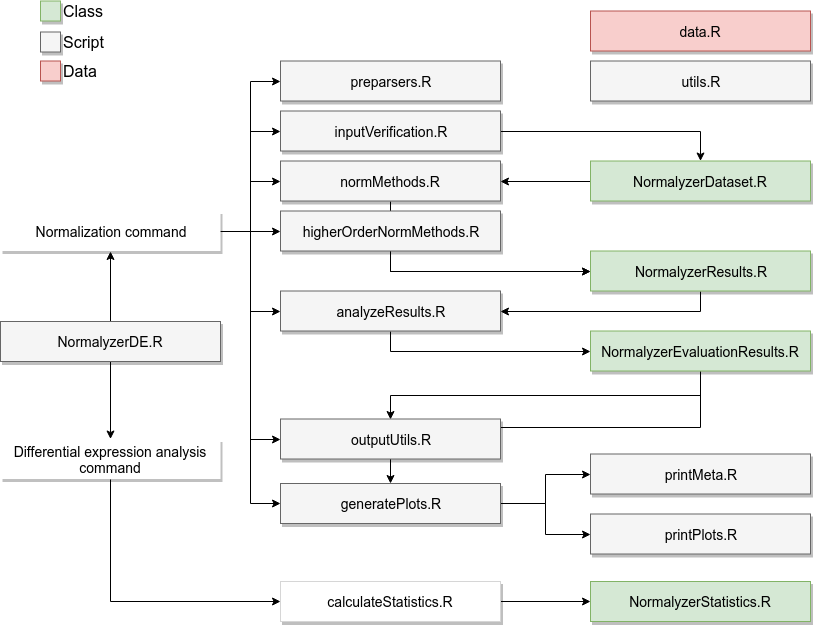

<!-- badges: start -->
[](https://bioconductor.org/checkResults/release/bioc-LATEST/NormalyzerDE/)
[](https://bioconductor.org/checkResults/devel/bioc-LATEST/NormalyzerDE/)
[](https://doi.org/10.1021/acs.jproteome.8b00523)
[](https://github.com/ComputationalProteomics/NormalyzerDE/actions/workflows/check-bioc.yml?query=branch%3Adevel)
[](https://github.com/ComputationalProteomics/NormalyzerDE/actions/workflows/pkgdown.yaml?query=branch%3Adevel)
[](https://bioconductor.org/packages/stats/bioc/NormalyzerDE/)
[](https://support.bioconductor.org/tag/NormalyzerDE)
[](https://bioconductor.org/packages/release/bioc/html/NormalyzerDE.html#since)
[](https://bioconductor.org/checkResults/devel/bioc-LATEST/NormalyzerDE/)
[](https://bioconductor.org/packages/release/bioc/html/NormalyzerDE.html)
<!-- badges: end -->

# NormalyzerDE

An online server running NormalyzerDE can be accessed at the following link:

https://quantitativeproteomics.org/normalyzerde

Alternatively:

https://normalyzerde.serve.scilifelab.se

NormalyzerDE is designed to evaluate normalization strategies for expression
data and to perform differential expression analysis in the same workflow.

NormalyzerDE supports delimited matrices, `SummarizedExperiment` objects, and
DIA-NN reports. It can evaluate normalization methods and perform differential
expression analysis using limma or limpa. limpa models
intensity-dependent missingness and propagates quantification uncertainty into
differential testing.

## Choose your workflow

- Use `normalyzer()` to compare normalization methods and write normalized matrices.
- Use `normalyzerDE()` to test differential expression on a chosen matrix.

For `limpa` workflows, ambiguous DIA-NN reports default to precursor-level
input unless `inputOptions` specify the level or columns explicitly.

## Citation

NormalyzerDE is published [here](https://pubs.acs.org/doi/10.1021/acs.jproteome.8b00523)

Willforss, J., Chawade, A., Levander, F. 
NormalyzerDE: Online Tool for Improved Normalization of Omics Expression Data and High-Sensitivity Differential Expression Analysis. *Journal of Proteome Research* **2018**, 10.1021/acs.jproteome.8b00523.

## Installation

We recommend installation from Bioconductor with
[BiocManager](https://cran.r-project.org/package=BiocManager):

```
install.packages("BiocManager")
BiocManager::install("NormalyzerDE")
```

Development versions can also be installed directly from GitHub:

```
pak::pak("ComputationalProteomics/NormalyzerDE")
```

## Common workflows

The examples below use simple job names and a temporary output directory.

```
library(NormalyzerDE)
out_dir <- tempdir()
design_path <- system.file(package="NormalyzerDE", "extdata", "tiny_design.tsv")
data_path <- system.file(package="NormalyzerDE", "extdata", "tiny_data.tsv")
norm_job <- "norm_example"
de_job <- "de_example"
limpa_norm_job <- "limpa_norm_example"
limpa_de_job <- "limpa_de_example"
```

Generate normalized matrices and an evaluation report:

```
normalyzer(
  jobName = norm_job,
  designPath = design_path,
  dataPath = data_path,
  outputDir = out_dir
)
```

Run differential expression on a selected normalized matrix:

```
norm_matrix_path <- file.path(out_dir, norm_job, "CycLoess-normalized.txt")

normalyzerDE(
  jobName = de_job,
  comparisons = "4-5",
  designPath = design_path,
  dataPath = norm_matrix_path,
  outputDir = out_dir,
  condCol = "group"
)
```

Use `limpaOptions()` to configure `limpa` workflows:

```
prequant_opts <- limpaOptions(
  byRow = TRUE,
  quantArgs = list(chunk = 1000L, verbose = FALSE)
)

de_opts <- limpaOptions(
  quantifiedRds = file.path(
    out_dir,
    limpa_norm_job,
    paste0(limpa_norm_job, "_limpa_quantified.rds")
  ),
  postQuantNorm = "median",
  deArgs = list(sample.weights = TRUE)
)

normalyzer(
  jobName = limpa_norm_job,
  designPath = design_path,
  dataPath = data_path,
  outputDir = out_dir,
  preQuant = "limpa",
  limpaOptions = prequant_opts,
  normalizeRetentionTime = FALSE
)

normalyzerDE(
  jobName = limpa_de_job,
  comparisons = "4-5",
  designPath = design_path,
  dataPath = file.path(out_dir, limpa_norm_job, "log2-normalized.txt"),
  outputDir = out_dir,
  condCol = "group",
  type = "limpa",
  logTrans = FALSE,
  limpaOptions = de_opts
)
```

Here, `log2-normalized.txt` is the completed log2 matrix written by
`normalyzer(preQuant = "limpa")`. Any optional between-sample normalization for
the differential testing step is controlled by
`limpaOptions(postQuantNorm = ...)`. Reusing the quantified `EList` is also
explicit: pass `limpaOptions(quantifiedRds = ...)` when you want `normalyzerDE()`
to use the saved cache.

In `limpaOptions()`, `postQuantNorm` accepts `"none"`, `"GI"`, `"median"`,
`"mean"`, `"Quantile"`/`"quantile"`, `"CycLoess"`, and `"RLR"`.

For a fuller walk-through, see the [Vignette](https://bioconductor.org/packages/devel/bioc/vignettes/NormalyzerDE/inst/doc/vignette.pdf) on NormalyzerDE's [Bioconductor page](https://bioconductor.org/packages/devel/bioc/html/NormalyzerDE.html). More information about required input formats is available [here](https://quantitativeproteomics.org/normalyzerde/help).

By default, `normalyzer()` and `normalyzerDE()` stop if the target output
directory already exists and contains files. This avoids mixing outputs from
different runs. You can still reuse an existing output directory, but you must
opt in explicitly with `reuseOutputDir = TRUE`.

## Command-line usage

You can run NormalyzerDE directly from the command line via `Rscript`:

```
Rscript -e 'NormalyzerDE::normalyzer(jobName="rscript_norm", designPath="test_design.tsv", dataPath="test_data.tsv", outputDir="results")'
Rscript -e 'NormalyzerDE::normalyzerDE(jobName="rscript_de", designPath="test_design.tsv", dataPath="results/rscript_norm/CycLoess-normalized.txt", outputDir="results", comparisons=c("1-2", "1-3"))'
```

If you rerun the same command, use a fresh job name or set
`reuseOutputDir = TRUE`.

## References

(1) Bolstad, B. preprocessCore: A collection of pre-processing functions. **2018**; https://github.com/bmbolstad/preprocessCore.

(2) Gentleman, R. C. et al. Bioconductor: open software development for computational biology and bioinformatics. *Genome Biol.* **2004**, 5, R80.

(3) Huber, W.; von Heydebreck, A.; Sultmann, H.; Poustka, A.; Vingron, M. Variance stabilization
applied to microarray data calibration and to the quantification of differential
expression. *Bioinformatics* **2002**, 18, S96–S104.

(4) Kammers, K.; Cole, R. N.; Tiengwe, C.; Ruczinski, I. Detecting significant changes in protein abundance. *EuPA Open Proteom.* **2015**, 7, 11-19.

(5) Lyutvinskiy, Y.; Yang, H.; Rutishauser, D.; Zubarev, R. A. In Silico Instrumental Response Correction Improves Precision of Label-free Proteomics and Accuracy of Proteomics-based Predictive Models. *Mol. Cell Proteomics* **2013**, 12, 2324–2331.

(6) Ritchie, M. E.; Phipson, B.; Wu, D.; Hu, Y.; Law, C. W.; Shi, W.; Smyth, G. K. limma powers differential expression analyses for RNA-sequencing and microarray studies. *Nucleic Acids Res.* **2015**, 43, e47.

(7) van Ooijen, M. P.; Jong, V. L.; Eijkemans, M. J.; Heck, A. J.; Andeweg, A. C.; Binai, N. A.; van den Ham, H.-J. Identification of differentially expressed peptides in high-throughput proteomics data. *Brief. Bioinform.* **2017**, 1–11.

(8) Wolfgang, H. et al. Orchestrating high-throughput genomic analysis with Bioconductor. *Nat. Methods* **2015**, 12, 115–121.

## Code organization

NormalyzerDE consists of a number of scripts and classes. They are focused around
two separate workflows. One is for normalizing and evaluating the normalizations. The
second is for performing differential expression analysis. Classes are contained in scripts with the same name.



The standard workflow for the normalization is the following:

* The `normalyzer` function in the `NormalyzerDE.R` script is called, starting the process.
* If applicable, the dataset is preprocessed into the standard format using code in `preparsers.R` or `diann.R`.
* The input is verified to capture standard errors early on using code in `inputVerification.R`. This results in an instance of the `NormalyzerDataset` class.
* The data is normalized using several normalization methods present in `normMethods.R`. This yields an instance of `NormalyzerResults` which links to the original `NormalyzerDataset` instance and also contains all the resulting normalized datasets.
* If `preQuant = "limpa"` is used, helper code in `limpa_utils.R` is used to quantify the input matrix before the Normalyzer normalization step.
* If specified (and if a column with retention time values is present) retention-time segmented approaches are performed by applying normalizations from `normMethods.R` over retention time using functions present in `higherOrderNormMethods.R`.
* The results are analyzed using functions present in `analyzeResults.R`. This yields an instance of `NormalyzerEvaluationResults` containing the evaluation results. This instance is attached to the `NormalyzerResults` object.
* The final results are sent to `outputUtils.R` where the normalizations are written to an output directory, and to `generatePlots.R` which contains visualizations for the performance measures. It also uses code in `printMeta.R` and `printPlots.R` to output the results in a desired format.

When a normalized matrix is selected the analysis proceeds to the statistical analysis.

* The `normalyzerDE` function in the `NormalyzerDE.R` script is called starting the differential expression analysis pipeline.
* An instance of `NormalyzerStatistics` is prepared containing the input data.
* Code in `calculateStatistics.R`, `NormalyzerStatistics.R`, and `limpa_utils.R` is used to calculate the statistical contrasts. The results are attached to the `NormalyzerStatistics` object.
* The resulting statistics are used to generate a report and an annotated output matrix where key statistical measures are attached to the original matrix.
