```{r setup, echo=FALSE, results="hide"}
# knitr::opts_chunk$set(tidy=FALSE, cache=TRUE, dev="png", message=FALSE,
# error=FALSE, warning=TRUE)
```

# Default use

Mention citing.

## Input format

NormalyzerDE expects a raw data file in the following format:

```
Example of format
```

Furthermore, it expects a design matrix:

```
Example of design matrix
```

The data matrix can be replaced with the output matrix from Proteios or peptide or protein (names?) output from MaxQuant.

Finally, it is possible to process using the format used in Normalyzer. There, no design matrix was used and sample groups were instead specified by adding an extra row at the top of the matrix.

```
Example of old format
```

## Processing

```{r}
head(readLines("design.tsv"))
```

```{r}
head(readLines("data.tsv"))
```

```{r}
library(NormalyzerDE)
normalyzer("data.tsv", "vignette_run", designMatrix="design.tsv", outputDir="testout")
```

## Evaluating results

This will generate a PDF containing 

### Detecting outliers

The total intensity barplot can be used to see whether any samples has unusually high or low total intensity.

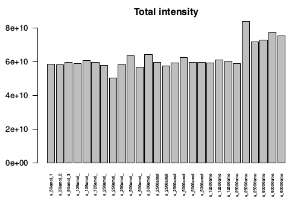

The total missing can show if any sample has an unusual number of missing values, which can indicate an outlier.

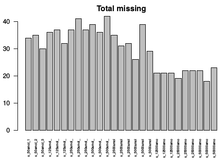

The MDS plot gives an indication of how samples seems to group overall. We expect replicates to cluster closely - in particular for technical replicates. If one or a few samples are far of here it might indicate outliers.

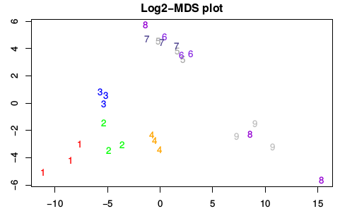

### Variance investigations

After normalization intragroup variance is expected to be reduced within the group. This gives an assessment of how much the different normalizations influence the data, and sometimes which seems to perform the strongest.

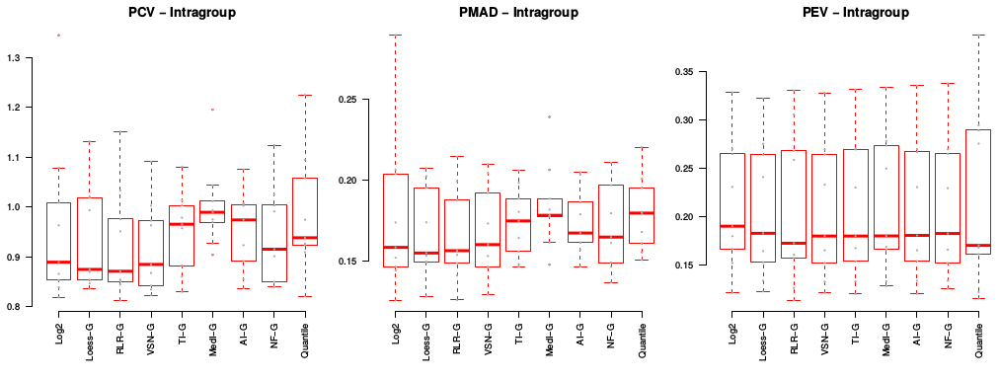

Normalization usually reduces variance measures compared to when doing a simple log2 transform. Similarly to the previous plot this gives an indication of how normalization influenced the variance in the data.

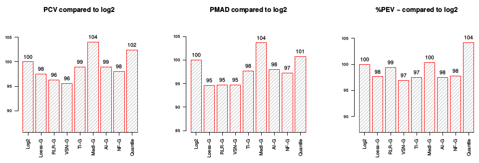

The stable variables plot looks into features identified as particularly stable and checks how different normalization approaches influence their intragroup and overall variance. 

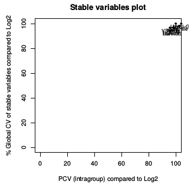

### Normalization comparisons

The scatter plot shows a distribution of CV over raw intensity for different normalization approaches (?).

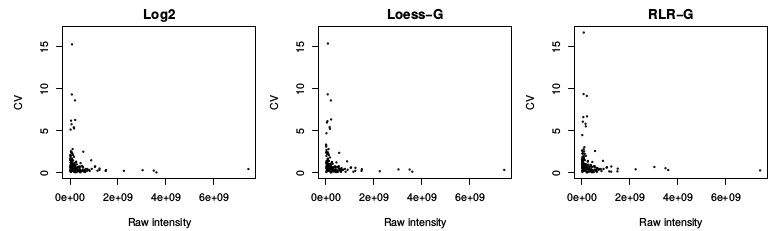

The MA plots shows the fold between the two first samples retrieved from the data matrix. Often in non-normalized there is a fold shift between samples which can be countered by normalization. Ideally the red fitting-line will go close to zero here.

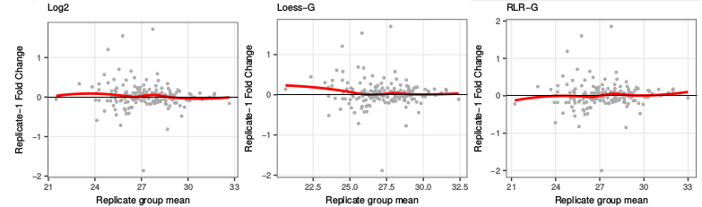

The scatter plot plots intensities of sample 1 against sample 2. This gives a sense of how the intensities varies between samples. There will always be a variation, but overall they are expected to be close to a linear trend, with similar variation around independent of intensity.

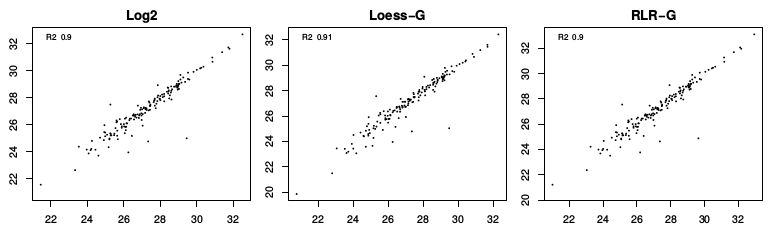

The QQ plot ...

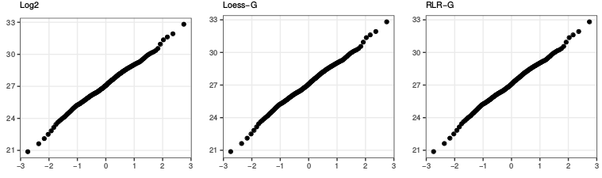

The intensity box plot...

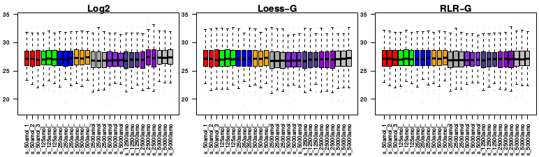

The fold plot...

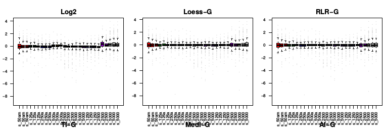

The sample density plots...

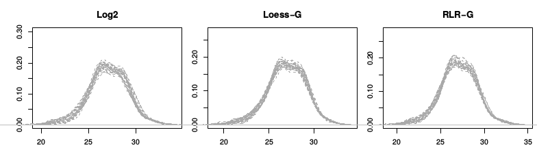

The MDS plots...

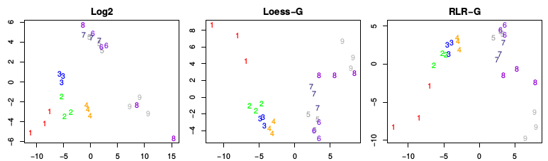

The dispersion plots...

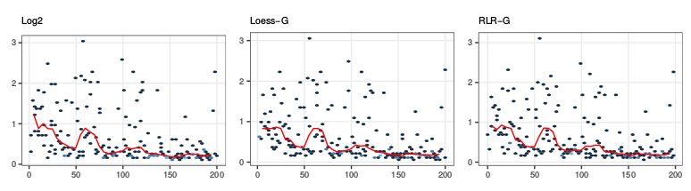

The correlation plots...

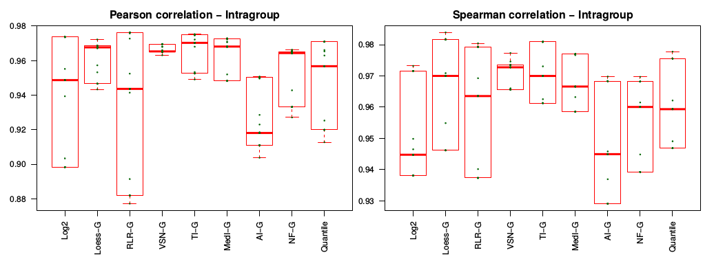

The clustering plot...

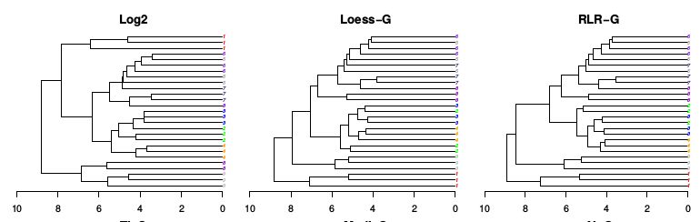

The differential expression plots...

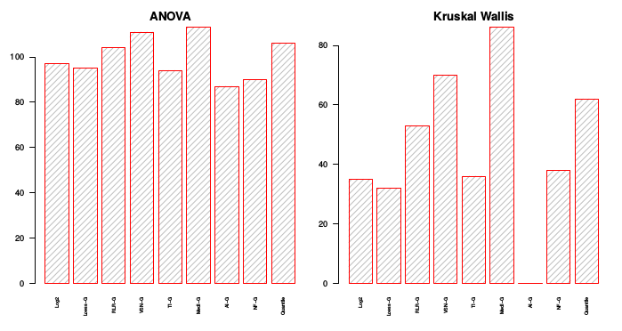

## Parameters

# Retention time normalization

Retention time based normalization can be performed with an arbitrary normalization matrix.

## Basic usage

There are two points of access for the higher order normalization. Either by calling `getRTNormalizedMatrix` which applies the target normalization approach stepwise over the matrix based on retention times, or by calling `getSmoothedRTNormalizedMatrix` which generates multiple layered matrices and combines them. To use them you need your raw data loaded into a matrix, a list containing retention times and a normalization matrix able to take a raw matrix and return a normalized in similar format.

```{r}
fullDf <- read.csv("data.tsv", sep="\t")
designDf <- read.csv("design.tsv", sep="\t")
head(fullDf)
head(designDf)
```

At this point we have loaded the full data into dataframes. Next, we use the sample names present in the design matrix to extract sample columns from the raw data. Be careful that the sample names is a character vector. If it is a factor it will extract wrong columns.

```{r}
sampleNames <- as.character(designDf$sample)
dataMat <- as.matrix(fullDf[, sampleNames])
retentionTimes <- fullDf$Average.RT

head(dataMat)
```

If everything is fine the data matrix should be `double`, and have the same number of rows as the number of retention time values we have.

```{r}
typeof(dataMat)

print("Rows and columns of data")
dim(dataMat)

print("Number of retention times")
length(retentionTimes)
```

The normalization function is expected to take a raw intensity matrix (?) and return log transformed values. We borrow the function for Loess normalization from NormalyzerDE. As long as it follow the same input/output format it could be replaced with a custom function.

```{r}
performCyclicLoessNormalization <- function(rawMatrix) {
    log2Matrix <- log2(rawMatrix)
    normMatrix <- limma::normalizeCyclicLoess(log2Matrix, method="fast")
    colnames(normMatrix) <- colnames(rawMatrix)
    normMatrix
}
```

We are ready to perform the normalization.

```{r}
rtNormMat <- getRTNormalizedMatrix(dataMat, retentionTimes, performCyclicLoessNormalization, stepSizeMinutes=1, windowMinCount=100)
```

Let's double check the results. We expect a matrix in the same format and shape as before. Furthermore, we expect similar but not the exact same values as if we'd applied the normalization globally.

```{r}
globalNormMat <- performCyclicLoessNormalization(dataMat)
dim(rtNormMat)
dim(globalNormMat)
head(rtNormMat, 1)
head(globalNormMat, 1)
```

### Performing layered normalization

We have everything set up to perform the layered normalization. The result here is expected to be overall similar to the normal retention time approach.

```{r}
layeredRtNormMat <- getSmoothedRTNormalizedMatrix(dataMat, retentionTimes, performCyclicLoessNormalization, stepSizeMinutes=1, windowMinCount=100, frameShifts=3, mergeMethod="mean")

dim(layeredRtNormMat)
head(layeredRtNormMat, 1)
```

## Defining a wrapper

# Stepwise processing

NormalyzerDE consists of a set of steps. You can influence the order of this processing using options (X and X), but they can also be called directly from R.

## Step 1: Loading data

```{r}
jobName <- "vignette_run"
normObj <- getVerifiedNormalyzerObject("data.tsv", jobName, "design.tsv")
```

## Step 2: Generate normalizations

```{r}
normResults <- normMethods(normObj)
```

## Step 3: Generate performance measures

```{r}
normResultsWithEval <- analyzeNormalizations(normResults)
```

## Step 4: Perform statistics

```{r}
```

## Step 5: Output matrices to file

```{r}
jobDir <- setupJobDir("vignette_run", ".")
writeNormalizedDatasets(normResultsWithEval, jobDir)
```

## Step 6: Generate evaluation plots

```{r}
generatePlots(normResultsWithEval, jobDir)
```


