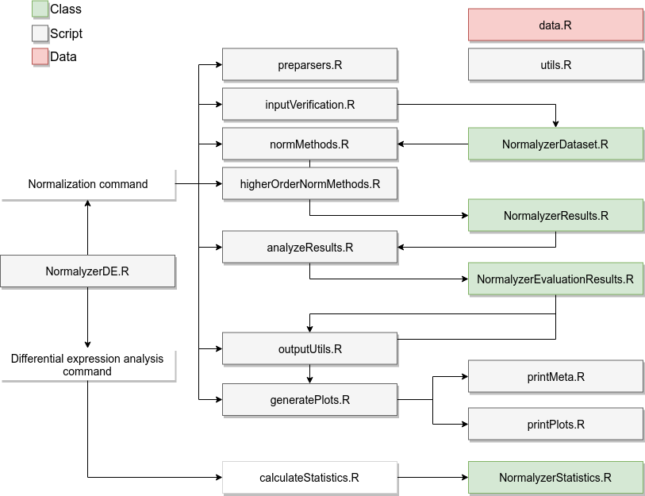

```{r setup, echo=FALSE, results="hide"}
# knitr::opts_chunk$set(tidy=FALSE, cache=TRUE, dev="png", message=FALSE,
# error=FALSE, warning=TRUE)
```

# Installation

Installation is preferably performed using BiocManager (requires R version >= 3.5):

```
install.packages("BiocManager")
BiocManager::install("NormalyzerDE")
```

# Default use

## Citing

Willforss, J., Chawade, A., Levander, F. Submitted article.

## Input format

NormalyzerDE expects a raw data file. Columns can contain annotation information or sample data.
Each column should start with a header.

```
pepseq  s1      s2      s3      s4
ATAAGG  20.0    21.2    19.4    18.5
AWAG    23.3    24.1    23.5    17.3
ACATGM  22.1    22.3    22.5    23.2
```

This data should be provided with a design matrix where all data samples should be represented.
One column (default header "sample") should match the columns containing samples in the raw data.
Another column (default header "group") should contain condition levels which could be used for group-based
evaluations.

```
sample  group
s1      condA
s2      condA
s3      condB
s4      condB
```

Alternatively the data can be provided as an instance of a `SummarizedExperiment` S4 class.

## Running NormalyzerDE evaluation

The evaluation step can be performed with one command, `normalyzer`.
This command expects a path to the data file, a name for the run-job,
a path to a design matrix and finally a path to an output directory.

Alternatively the `designPath` and `dataPath` arguments can be replaced with the `experimentObj` argument
where the first assay should contain the data matrix of interest, the `colData` attribute the design matrix
and the `rowData` attribute the annotation columns.

```{r}
library(NormalyzerDE)
outDir <- tempdir()
designFp <- system.file(package="NormalyzerDE", "extdata", "tiny_design.tsv")
dataFp <- system.file(package="NormalyzerDE", "extdata", "tiny_data.tsv")
normalyzer(jobName="vignette_run", designPath=designFp, dataPath=dataFp, 
           outputDir=outDir)
```

## Running NormalyzerDE statistical comparisons

When you after performing the evaluation and having evaluated the report have decided
for which normalization approach seems to work best you can continue to the statistical step.

Here, expected parameters are the path to the target normalization matrix, the sample design matrix as
in the previous step, a job name, the path to an output directory and a list of the pairwise comparisons
for which you want to calculate contrasts. They are provided as a character vector with conditions to
compare separated by a dash ("-").

Similarly as for the normalization step the `designPath` and `dataPath` arguments can be replaced with
an instance of `SummarizedExperiment` sent to the `experimentObj` argument.

```{r}
normMatrixPath <- paste(outDir, "vignette_run/CycLoess-normalized.txt", sep="/")
normalyzerDE("vignette_run", 
             comparisons=c("4-5"),
             designPath=designFp, 
             dataPath=normMatrixPath,
             outputDir=outDir, 
             condCol="group")
```

## Running NormalyzerDE using a SummarizedExperiment object as input

A benefit of using a SummarizedExperiment object as input is that it allows executing NormalyzerDE using variables as input instead of loading from file.

The conversion of `designMatrix$sample` is required if using `read.table` as it otherwise is interpreted as a factor. For more intuitive behaviour you can use `read_tsv` from the `readr` package instead of `read.table`.

```{r}
dataMatrix <- read.table(dataFp, sep="\t", header = TRUE)
designMatrix <- read.table(designFp, sep="\t", header = TRUE)
designMatrix$sample <- as.character(designMatrix$sample)
dataOnly <- dataMatrix[, designMatrix$sample]
annotOnly <- dataMatrix[, !(colnames(dataMatrix) %in% designMatrix$sample)]

sumExpObj <- SummarizedExperiment::SummarizedExperiment(
    as.matrix(dataOnly),
    colData=designMatrix,
    rowData=annotOnly
)

normalyzer(jobName="sumExpRun", experimentObj = sumExpObj, outputDir=outDir)
```

# Retention time normalization

Retention time based normalization can be performed with an arbitrary normalization matrix.

## Basic usage

There are two points of access for the higher order normalization. Either by calling `getRTNormalizedMatrix` which applies the target normalization approach stepwise over the matrix based on retention times, or by calling `getSmoothedRTNormalizedMatrix` which generates multiple layered matrices and combines them. To use them you need your raw data loaded into a matrix, a list containing retention times and a normalization matrix able to take a raw matrix and return a normalized in similar format.

```{r}
fullDf <- read.csv(dataFp, sep="\t")
designDf <- read.csv(designFp, sep="\t")
head(fullDf, 1)
head(designDf, 1)
```

At this point we have loaded the full data into dataframes. Next, we use the sample names present in the design matrix to extract sample columns from the raw data. Be careful that the sample names is a character vector. If it is a factor it will extract wrong columns.

Make sure that sample names extracted from design matrix are in right format. We expect it to be in 'character' format.

```{r}
sampleNames <- as.character(designDf$sample)
typeof(sampleNames)
```

Now we are ready to extract the data matrix from the full matrix. We also need to get the retention time column from the full matrix.

```{r}
dataMat <- as.matrix(fullDf[, sampleNames])
retentionTimes <- fullDf$Average.RT

head(dataMat, 1)
```

If everything is fine the data matrix should be `double`, and have the same number of rows as the number of retention time values we have.

```{r}
typeof(dataMat)

print("Rows and columns of data")
dim(dataMat)

print("Number of retention times")
length(retentionTimes)
```

The normalization function is expected to take a raw intensity matrix and return log transformed values. We borrow the wrapper function for Loess normalization from NormalyzerDE. It can be replaced with any custom function as long as the wrapper has the same input/output format.

```{r}
performCyclicLoessNormalization <- function(rawMatrix) {
    log2Matrix <- log2(rawMatrix)
    normMatrix <- limma::normalizeCyclicLoess(log2Matrix, method="fast")
    colnames(normMatrix) <- colnames(rawMatrix)
    normMatrix
}
```

We are ready to perform the normalization.

```{r}
rtNormMat <- getRTNormalizedMatrix(dataMat, 
                                   retentionTimes, 
                                   performCyclicLoessNormalization, 
                                   stepSizeMinutes=1, 
                                   windowMinCount=100)
```

Let's double check the results. We expect a matrix in the same format and shape as before. Furthermore, we expect similar but not the exact same values as if we'd applied the normalization globally.

```{r}
globalNormMat <- performCyclicLoessNormalization(dataMat)
dim(rtNormMat)
dim(globalNormMat)
head(rtNormMat, 1)
head(globalNormMat, 1)
```

## Performing layered normalization

We have everything set up to perform the layered normalization. The result here is expected to be overall similar to the normal retention time approach.

```{r}
layeredRtNormMat <- getSmoothedRTNormalizedMatrix(
    dataMat, 
    retentionTimes, 
    performCyclicLoessNormalization, 
    stepSizeMinutes=1, 
    windowMinCount=100, 
    windowShifts=3, 
    mergeMethod="mean")

dim(layeredRtNormMat)
head(layeredRtNormMat, 1)
```

# Stepwise processing (normalization part)

NormalyzerDE consists of a set of steps. The workflow can be run as a whole, or step by step.

## Step 1: Loading data

This step performs input validation of the data, and generates an object of the class NormalyzerDataset.

```{r}
jobName <- "vignette_run"
experimentObj <- setupRawDataObject(dataFp, designFp, "default", TRUE, "sample", "group")
normObj <- getVerifiedNormalyzerObject(jobName, experimentObj)
```

The function `setupRawDataObject` returns a `SummarizedExperiment` object.
This object can be prepared directly and should in that case contain the raw
data as the default assay, the design matrix as `colData` and annotation rows
as `rowData`.

## Step 2: Generate normalizations

Here, normalizations are performed. This generates a NormalyzerResults object containing both a reference to its original dataset object, but also generated normalization matrices.

```{r}
normResults <- normMethods(normObj)
```

## Step 3: Generate performance measures

Performance measures are calculated for normalizations. These are stored in an object NormalizationEvaluationResults. A NormalyzerResults object similar to the one sent in is returned, but with this field added.

```{r}
normResultsWithEval <- analyzeNormalizations(normResults)
```

## Step 4: Output matrices to file

Generated normalization matrices are written to the provided folder.

```{r}
jobDir <- setupJobDir("vignette_run", tempdir())
writeNormalizedDatasets(normResultsWithEval, jobDir)
```

## Step 5: Generate evaluation plots

Performance measures are used to generate evaluation figures which is written in an evaluation report.

```{r}
generatePlots(normResultsWithEval, jobDir)
```

After this evaluation of normalizations and progression to statistics follows as described previously in this report.

# Stepwise processing (differential expression analysis part)

## Step 1: Setup folders and data matrices

For continued processing you select the matrix containing the normalized data
from the best performing normalization. The design matrix is the same as for
the normalization step.

```{r}
bestNormMatPath <- paste(jobDir, "RT-Loess-normalized.txt", sep="/")
experimentObj <- setupRawContrastObject(bestNormMatPath, designFp, "sample")
nst <- NormalyzerStatistics(experimentObj, logTrans=FALSE)
```

Similarly as to for the normalization evaluation step the `experimentObj`
above can be prepared directly as a `SummarizedExperiment` object.

## Step 2: Calculate statistics

Now we are ready to perform the contrasts. Contrasts are provided as a vector
in the format `c("condA-condB", "condB-condC")`, where `condX` is the group levels.

```{r}
comparisons <- c("4-5")
nst <- calculateContrasts(nst, comparisons, condCol="group", leastRepCount=2)
```

## Step 3: Generate final matrix and output

Finally we generate a table containing the statistics results for each feature
and write it to file together with an evaluation report containing P-value histograms
for each comparison.

```{r}
annotDf <- generateAnnotatedMatrix(nst)
utils::write.table(annotDf, file=paste(jobDir, "stat_table.tsv", sep="/"))
generateStatsReport(nst, "Vignette stats", jobDir)
```

# Code organization

NormalyzerDE consists of a number of scripts and classes. They are focused around
two separate workflows. One is for normalizing and evaluating the normalizations. The
second is for performing differential expression analysis. Classes are contained in scripts with the same name.

Code organization:



The standard workflow for the normalization is the following:

* The `normalyzer` function in the `NormalyzerDE.R` script is called, starting the process.
* If applicable (that is, input is in Proteois or MaxQuant format), the dataset is preprocessed into the standard format using code in `preparsers.R`.
* The input is verified to capture standard errors early on using code in `inputVerification.R`. This results in an instance of the `NormalyzerDataset` class.
* The data is normalized using several normalization methods present in `normMethods.R`. This yields an instance of `NormalyzerResults` which links to the original `NormalyzerDataset` instance and also contains all the resulting normalized datasets.
* If specified (and if a column with retention time values is present) retention-time segmented approaches are performed by applying normalizations from `normMethods.R` over retention time using functions present in `higherOrderNormMethods.R`.
* The results are analyzed using functions present in `analyzeResults.R`. This yields an instance of `NormalyzerEvaluationResults` containing the evaluation results. This instance is attached to the `NormalyzerResults` object.
* The final results are sent to `outputUtils.R` where the normalizations are written to an output directory, and to `generatePlots.R` which contains visualizations for the performance measures. It also uses code in `printMeta.R` and `printPlots.R` to output the results in a desired format.

When a normalized matrix is selected the analysis proceeds to the statistical analysis.

* The `normalyzerde` function in the `NormalyzerDE.R` script is called starting the differential expression analysis pipeline.
* An instance of `NormalyzerStatistics` is prepared containing the input data.
* Code in the `calculateStatistics.R` script is used to calculate the statistical contrasts. The results are attached to the `NormalyzerStatistics` object.
* The resulting statistics are used to generate a report and an annotated output matrix where key statistical measures are attached to the original matrix.

# Used packages

```{r}
sessionInfo()
```

